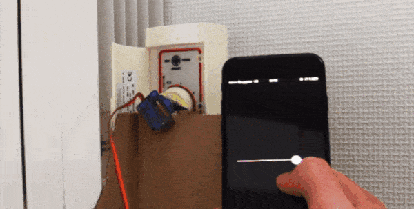
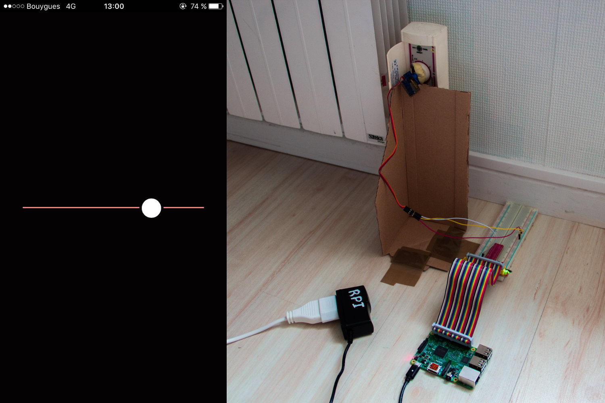

# RPi thermostat

Transform your RPi into a very simple connected thermostat

## Install

### Server
You need to set up a VPS for the thermostat interface. Simply put the files from the `server` folder on your vps, install the dependencies `npm i`, then run `server.js`. I recommend you to use [forever](https://github.com/foreverjs/forever) to keep your script running.

### Raspberry Pi

For this project you need one RPi connected to the Internet, a Servo Motor (mine is the popular SG90), and if you want a breadboard.

Connect all theses component together, the Servo Motor is on Pin 22. Then put the file `rpi.py`  on your card, don't forget to edit your VPS IP adresss in the file.

And voilà ! You can access the web interface on the port 1999 from your VPS IP adresss and you now control your radiator from everywhere in the world.

### Future

This is actually the strict minimum for a connected thermostat, There is so many possible features to develop :
- Increase the temperature just before wake-up time
- Turn the radiator on and off according to the position of the person (by using ifttt)
- Add a temperature sensor to adjust the setting for a desired temperature setting
- Turn off the radiator if it was at the maximum setting for a too long time to prevent fire
